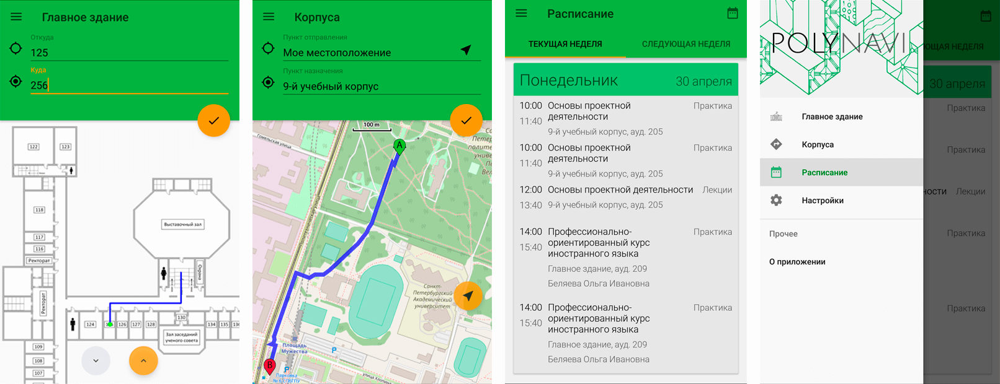

# POLYNAVI

POLYNAVI - Navigation and schedule for SPbPU students. Unofficial app.

## License

The source code is licensed under the MIT license ([LICENSE](LICENSE)).

Graphical assets are licensed under different licenses. See [ASSETS_LICENSES.md](ASSETS_LICENSES.md) file for more information.

This project uses third party libraries that are distributed under their own terms. See [LICENSE-3RD-PARTY.txt](LICENSE-3RD-PARTY.txt) file for more info.
